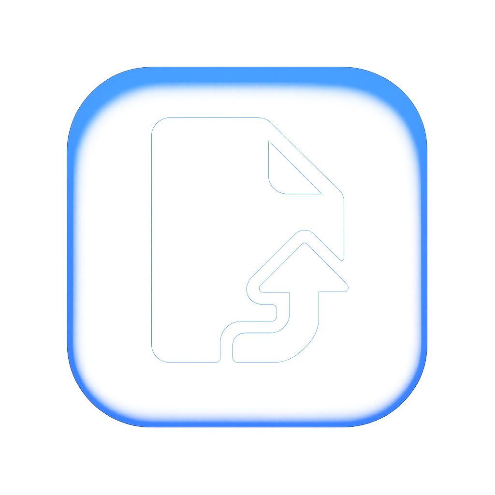

# DropDesk



A lightweight Electron.js desktop application that sits in your system tray, allowing you to easily drag & drop files for quick access to file information and management.

## Features

- **System Tray Integration**: Runs silently in the status bar (macOS menu bar / Windows system tray)
- **Drag & Drop Support**: Drop files directly onto the tray icon or into the app window
- **File Information**: Shows detailed file metadata including name, size, creation date, and type
- **File Operations**: Copy files to clipboard, open in default application, or show in folder
- **Persistent History**: Keeps track of all dropped files across sessions
- **Search**: Find files by name or path
- **Export History**: Save your file history as a JSON file
- **Theme Support**: Light and dark themes

## Quick Start

### Prerequisites
- Node.js (v14 or higher)
- npm or yarn

### Installation

1. Clone or download the project
   ```bash
   git clone <repository-url>
   cd DropDesk
   ```

2. Install dependencies
   ```bash
   npm install
   ```

3. Run the application
   ```bash
   npm start
   ```

### Usage

1. The app will appear in your system tray (menu bar on macOS)
2. Click the tray icon to open the main window
3. Drag and drop files into the drop zone or onto the tray icon
4. Access file operations through the interface

## Platform Support

### Windows


### Mac


## Project Structure

```
DropDesk/
├── src/
│   ├── main.js              # Electron main process entry point
│   ├── tray.js              # System tray management
│   ├── dropWindow.js        # Main application window
│   ├── fileManager.js       # File operations and data management
│   ├── preload.js           # Secure IPC communication bridge
│   └── renderer/
│       ├── index.html       # Main UI
│       ├── renderer.js      # Main UI logic
│       └── styles.css       # Application styles
├── data/
│   ├── history.json         # File history storage
│   └── settings.json        # User preferences
├── images/                  # README images
├── package.json             # Project configuration
└── README.md               # This file
```

## Development

### Available Scripts
- `npm start` - Run the application in development mode
- `npm run dev` - Run with development tools enabled

## License

MIT License